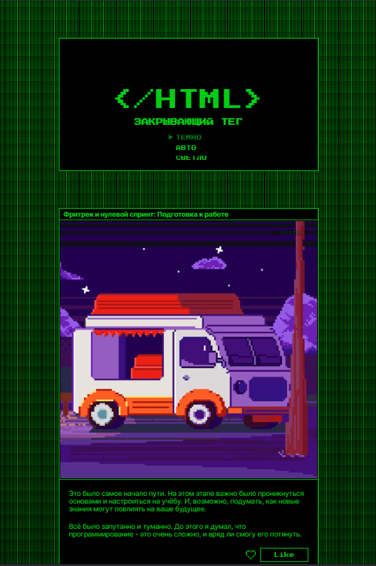
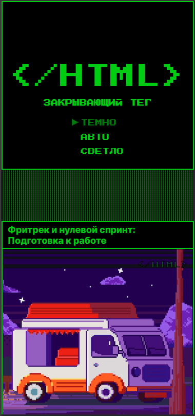
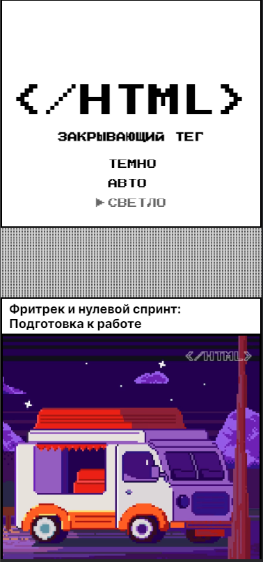

https://github.com/lev1996frontend/zakrivayuschiy-teg-f.git
# Яндекс Практикум, проектная работа "Закрывающий тег"

## Оглавление

	- [Скриншоты](#скриншоты)
	- [Ссылки](#ссылки)
	- [Автор](#автор)

### Скриншоты

### Ссылки

- URL решения: [Github](https://github.com/lev1996frontend/zakrivayuschiy-teg-f.git)
- URL лайв сервера: [Github](https://lev1996frontend.github.io/slozhno-sosredotochitsya/)

## Автор

- Github - [lev1996frontend](https://github.com/lev1996frontend)