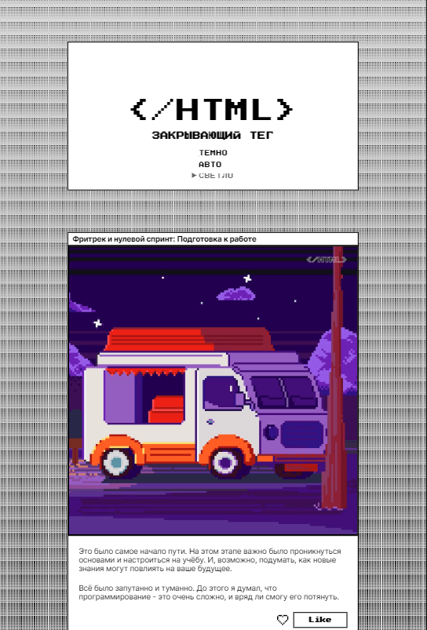

https://github.com/lev1996frontend/zakrivayuschiy-teg-f.git

# Яндекс Практикум, проектная работа "Закрывающий тег"

## Оглавление

  - [Скриншоты](#Скриншоты)
  - [Ссылки](#Ссылки)
  - [Автор](#Автор)

### Скриншоты

### Ссылки

- URL решения: [Github](https://github.com/lev1996frontend/zakrivayuschiy-teg-f.git)
- URL лайв сервера: [Github](https://lev1996frontend.github.io/zakrivayuschiy-teg-f/)

## Автор

- Github - [lev1996frontend](https://github.com/lev1996frontend)
